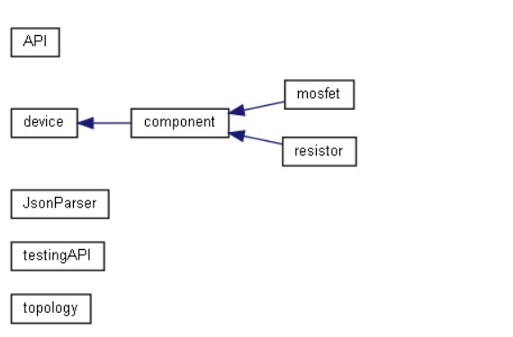
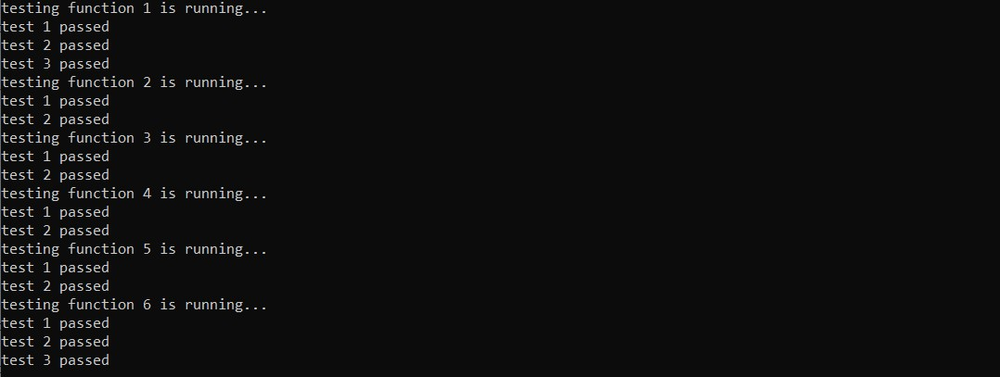

# TopologyAPI
> #### This is a simple API with C++ to apply some operation on topology reading it from json file.

### External Libraries
> **[json/hpp](https://github.com/nlohmann/json)**

### Documentation

> #### Open the file path **documentation/html/index.html**

### Class  Hierarchy

### Testing API

